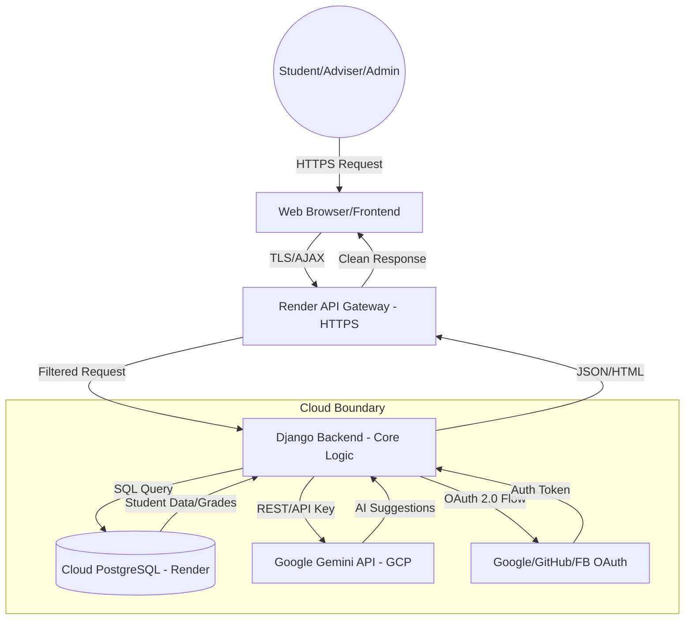

# Threat Modeling Report: WebSys2-Advise-AI (Advise AI)

## 2. Introduction
**Brief Description of the System Modeled**
The system, **Advise AI**, is a web-based academic advising and enrollment management platform designed for the Technological Institute of the Philippines (TIP). It streamlines the interaction between students, academic advisers, and administrators. Key functionalities include course tracking for BSIT and BSCS programs, enrollment code generation, automated subject recommendations, messaging, and an AI-powered virtual assistant integrated via Google Gemini.

**Objective of the Project**
The primary objective is to identify, assess, and prioritize potential security threats and vulnerabilities within the Advise AI ecosystem. This analysis aims to ensure the integrity of academic records, the confidentiality of student PII, and the availability of critical advising services.

**Importance of Threat Modeling in System and Cloud Security**
Threat modeling allows developers to identify security flaws early in the lifecycle. As modern systems increasingly rely on decentralized components, a structured approach like STRIDE helps in anticipating attack vectors that might otherwise be overlooked during traditional testing.

**Relevance of Cloud Security Considerations**
Advise AI is a cloud-native application. Incorporating cloud security is critical because:
- **Data Storage**: Student records are stored in a cloud-hosted database.
- **Authentication**: The system relies on third-party Identity Providers (Google, GitHub, Facebook) via OAuth 2.0.
- **API Endpoints**: The core application and the Gemini AI assistant are hosted on cloud platforms (Render/GCP), making them susceptible to cloud-specific risks like misconfigured IAM, API quota exhaustion, and credential leakage.

---

## 3. System Overview
**System and Cloud-Hosted Components**
- **Hosting Platform**: **Render** (Platform-as-a-Service) handles the web server and API gateway.
- **AI Engine**: **Google Gemini 1.5 Flash** (GCP) provides the virtual assistant logic.
- **Identity Providers**: **Google, GitHub, and Facebook** (via `django-allauth`) handle federated authentication.
- **Data Storage**: **Cloud PostgreSQL** (Render Managed Database) stores all persistent records.

**Key Features and Data Types Handled**
- **Features**: Enrollment code redemption, subject recommendation engine, real-time messaging, appointment scheduling.
- **Data Types**: 
    - **PII**: Full names, student IDs, email addresses.
    - **Academic Records**: Course grades, enrollment status, curriculum progress.
    - **Credentials**: OAuth tokens, API secrets (stored in environment variables).
    - **Communications**: Private chat history between students and advisers.

**System Architecture**
- **Web Front-end**: HTML5, Vanilla CSS, and JavaScript using Django Templates.
- **Backend API**: Django (Python) framework handling business logic and security middleware.
- **Cloud APIs**: REST/gRPC interfaces for Gemini AI and Social Auth Providers.
- **Network**: HTTPS/TLS encryption for all data in transit.

**Users and Roles**
- **Student**: Can view curriculum, redeem codes, chat with advisers, and interact with the AI assistant.
- **Adviser**: Can manage assigned students, generate enrollment codes, and schedule appointments.
- **Admin**: System-wide oversight, grade management, and user role configuration.

---

## 4. Methodology
**STRIDE Threat Modeling**
We utilized the STRIDE approach to categorize threats:
- **S**poofing: Faking identity (e.g., unauthorized login).
- **T**ampering: Unauthorized data modification (e.g., changing grades).
- **R**epudiation: Denying an action (e.g., denying an enrollment request).
- **I**nformation Disclosure: Unauthorized data access (e.g., leaking chat logs).
- **D**enial of Service: Exhausting resources (e.g., Gemini API quota flooding).
- **E**levation of Privilege: Gaining higher access (e.g., student becoming an Admin).

**DREAD Risk Assessment**
Threats are scored from 1-10 on:
- **D**amage Potential: How much harm can it cause?
- **R**eproducibility: How easy is it to repeat?
- **E**xploitability: How easy is it to launch the attack?
- **A**ffected Users: How many users are impacted?
- **D**iscoverability: How easy is it to find the flaw?

**Tools Used**
- **Diagramming tool**: Mermaid.js for architecture and DFD visualization.
- **Security Tools**: `django-ratelimit` for DoS protection, WhiteNoise for static file security, and Python's `os.environ` for secret management.

---

## 5. Data Flow Diagram (DFD)

---

## 6. STRIDE Analysis

| Element | S | T | R | I | D | E |
| :--- | :---: | :---: | :---: | :---: | :---: | :---: |
| **Login / OAuth Process** | ✔ | | | ✔ | ✔ | |
| **Enrollment System** | | ✔ | ✔ | | | ✔ |
| **Cloud API Gateway (Gemini)** | ✔ | | | ✔ | ✔ | |
| **Cloud Database (PostgreSQL)** | | ✔ | | ✔ | ✔ | |
| **Messaging Engine** | ✔ | | | ✔ | | |

**Analysis Details:**
- **Login**: Potential for credential stuffing or token theft (Spoofing).
- **Gemini API**: API key leakage (Information Disclosure) or quota flooding (DoS).
- **Database**: SQL injection risk if ORM is bypassed (Tampering).
- **Enrollment**: Manipulating subject IDs in POST requests (Elevation of Privilege).

---

## 7. DREAD Risk Assessment

| Threat | D | R | E | A | D | Avg |
| :--- | :---: | :---: | :---: | :---: | :---: | :---: |
| **SQL Injection (ORM Bypass)** | 10 | 2 | 2 | 10 | 3 | **5.4** |
| **Gemini API Key Exposure** | 9 | 10 | 9 | 10 | 5 | **8.6** |
| **Broken Access Control (Role Switch)** | 9 | 4 | 3 | 5 | 4 | **5.0** |
| **Brute Force on Admin Login** | 7 | 8 | 8 | 1 | 9 | **6.6** |
| **Insecure Cloud Storage (Render Logs)** | 5 | 3 | 3 | 10 | 4 | **5.0** |
| **MFA Lack in Student Accounts** | 6 | 9 | 9 | 10 | 9 | **8.6** |

---

## 8. Mitigation Strategies

### High-Priority Countermeasures
1. **Gemini API Security**: 
    - **Mitigation**: Move `GEMINI_API_KEY` to Render's "Environment Groups". Implement server-side check for prompt length.
    - **Justification**: Prevents financial loss from key theft and service denial.
2. **Access Control (RBAC)**:
    - **Mitigation**: Enforce `@adviser_required` and `@admin_required` decorators on all API endpoints.
    - **Justification**: Essential to prevent students from approving their own enrollments.
3. **Multi-Factor Authentication (MFA)**:
    - **Mitigation**: Enable MFA via `django-allauth-2fa` for staff accounts.
    - **Justification**: Protects against credential theft for users with elevated privileges.
4. **Rate Limiting**:
    - **Mitigation**: Expand `django-ratelimit` to all POST endpoints (Messaging, Code Redemption).
    - **Justification**: Protects against automated spam and DoS attacks on the database.

---

## 9. Conclusion

**Summary of Key Findings**
The Advise AI system has a robust base using modern frameworks. However, the integration with cloud-native APIs (Gemini) represents the largest attack surface due to potential key exposure and quota exhaustion. The enrollment workflow is the most sensitive business logic requiring strict server-side validation.

**Cloud Security Insights**
The shared responsibility model applies here: Render secures the infrastructure, but Advise AI developers must secure the application logic and secret management. Federated identities (OAuth) significantly reduce the risk of password storage breaches.

**Lessons Learned (Generic)**
- **Member 1**: Understanding how OAuth tokens are stored and secured within a Django environment.
- **Member 2**: Learning to evaluate the risk of third-party AI APIs and the necessity of rate-limiting external calls.
- **Member 3**: Visualizing data flows between local logic and cloud-hosted databases.

**Limitations and Recommendations**
- **Limitation**: The current system relies on SQLite for local development; minor configuration differences could exist on production PostgreSQL.
- **Recommendation**: Perform a production-ready security audit using tools like `bandit` (Python) and `OWASP ZAP` before deployment.
