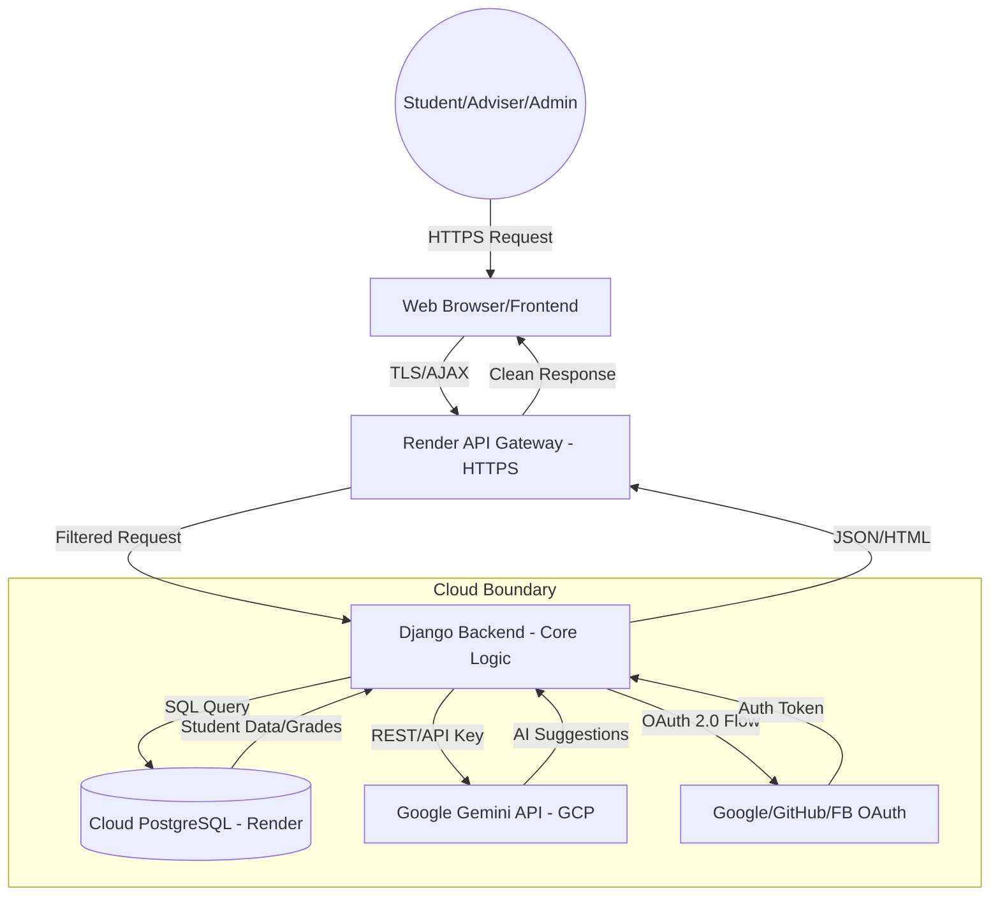

# Threat Modeling Report: WebSys2-Advise-AI (Advise AI)

## 2. Introduction
**Brief Description of the System Modeled**
The system, **Advise AI**, is a web-based academic advising and enrollment management platform. It streamlines the interaction between students, academic advisers, and administrators. Key functionalities include course tracking for BSIT and BSCS programs, enrollment code generation, automated subject recommendations, messaging, and an AI-powered virtual assistant integrated via Google Gemini.

**Objective of the Project**
To identify, assess, and prioritize potential security threats and vulnerabilities within the Advise AI ecosystem. This analysis ensures the integrity of academic records, confidentiality of student PII, and availability of critical advising services.

**Importance of Threat Modeling in System and Cloud Security**
Threat modeling allows developers to identify security flaws early in the lifecycle. STRIDE helps in anticipating attack vectors that might otherwise be overlooked.

**Relevance of Cloud Security Considerations**
Incorporating cloud security is critical because:
- **Data Storage**: Student records are in a cloud-hosted database (PostgreSQL).
- **Authentication**: Relies on third-party Identity Providers (Google, GitHub, Facebook).
- **API Endpoints**: Core logic and Gemini AI are hosted on Render/GCP.

---

## 3. System Overview
**System and Cloud-Hosted Components**
- **Hosting**: Render (Web Server, API Gateway).
- **AI Engine**: Google Gemini 1.5 Flash (GCP).
- **Auth**: Google/GitHub/Facebook OAuth.
- **Database**: Cloud PostgreSQL (Render).

**Key Features and Data Types Handled**
- **Features**: Enrollment code redemption, recommendation engine, messaging, appointments.
- **Data Types**: PII (Names, IDs, Emails), Academic records (Grades, progress), OAuth tokens, API secrets.

**System Architecture**
- **Front-end**: HTML5, Vanilla CSS, JS (Django Templates).
- **Back-end**: Django (Python).
- **Cloud APIs**: REST interface for Gemini and Social Auth.

**Users and Roles**
- **Student**: View curriculum, redeem codes, chat.
- **Adviser**: Manage students, generate codes.
- **Admin**: System oversight, grade management.

---

## 4. Methodology
**STRIDE Analysis**: Spoofing, Tampering, Repudiation, Information Disclosure, Denial of Service, Elevation of Privilege.
**DREAD Assessment**: Damage, Reproducibility, Exploitability, Affected users, Discoverability.

---

## 5. Data Flow Diagram (DFD)

---

## 6. STRIDE Analysis

| Element | S | T | R | I | D | E |
| :--- | :---: | :---: | :---: | :---: | :---: | :---: |
| **Login / OAuth Process** | ✔ | | | ✔ | ✔ | |
| **Enrollment System** | | ✔ | ✔ | | | ✔ |
| **Cloud API Gateway (Gemini)** | ✔ | | | ✔ | ✔ | |
| **Cloud Database (PostgreSQL)** | | ✔ | | ✔ | ✔ | |
| **Messaging Engine** | ✔ | | | ✔ | | |

---

## 7. DREAD Risk Assessment

| Threat | Avg Score | Main File Impacted |
| :--- | :---: | :--- |
| **SQL Injection (ORM Bypass)** | 5.4 | `django/core/models.py` |
| **Gemini API Key Exposure** | 8.6 | `django/config/settings.py` |
| **Broken Access Control** | 5.0 | `django/core/decorators.py` |
| **MFA Lack in Student Accounts** | 8.6 | `django/core/views.py` |

---

## 8. Mitigation Strategies
1. **API Security**: Move secrets to environment variables in `django/config/settings.py`.
2. **Access Control**: Enforce decorators in `django/core/decorators.py`.
3. **MFA**: Enable for staff via `allauth`.
4. **Rate Limiting**: Apply in `django/core/views.py`.

---

## 9. Conclusion
The system uses modern frameworks with robust security bases. Cloud API integration with Gemini is the largest surface area. Relative paths in `django/` must be audited regularly for security compliance.
